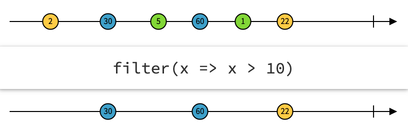
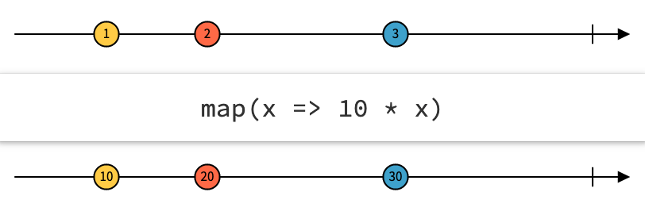
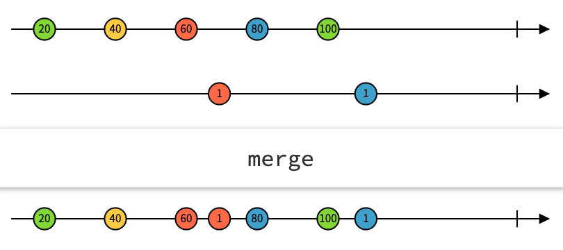
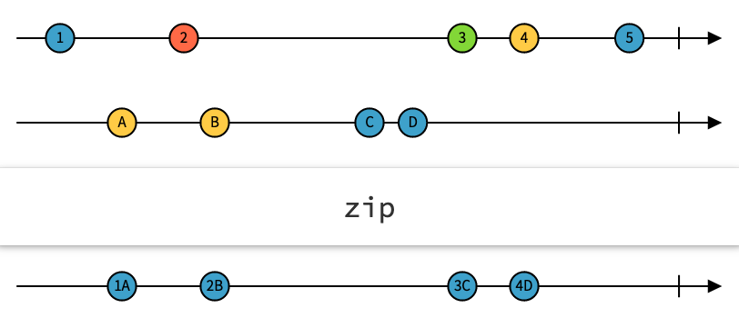
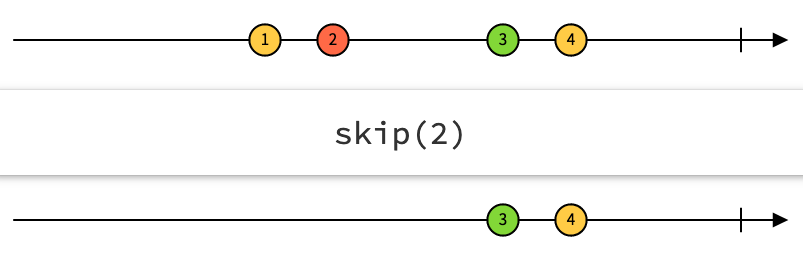
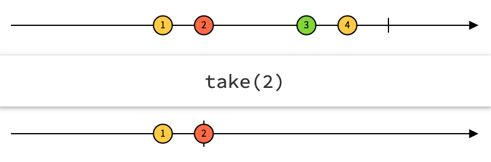

# Project Reactor

Project Reactor related stuff, such as code samples, test examples, best practices, etc.

The [Project Reactor](https://projectreactor.io/) is Spring Framework's choice for the [Reactive](https://spring.io/reactive) implementation. 
The original standard can be found at [Reactive Streams](https://www.reactive-streams.org/) and the 
manifesto can be found at [Reactive Manifesto](https://www.reactivemanifesto.org/). 


**How to Compile**

You can compile the project only by running the `mvnw` command line script.

On *nix environment you may run the `mvnw` shell script,
```bash
./mvnw clean install
```

On Windows environment you may run the `mvnw.cmd` command.
```bash
mvnw.cmd clean install
```

[](https://circleci.com/gh/canmogol/project-reactor/tree/master)

**Examples**

You can find the usage examples in the tests. 

1. Reactive Programming 101
    1. What is Reactive
    1. Flux basics
    1. Marble diagrams
    1. Cold Fluxes
    1. Hot Fluxes

1. Core In Action
    1. Count Letter In Phrases
    1. Temporal Dimension

1. Advanced Features
    1. Hot Sequence
    1. Testing and Debugging

1. Use In Spring
    1. Spring WebFlux Controller
    1. WebClient


## Reactive Programming 101
An alternate programming paradigm. It is a declarative programming paradigm 
concerned with data streams, and the propagation of change.

### What is Reactive
Simplify clean coding and asynchronous Event-Driven programs.

Declarative tools for Concise, Error-Free code, especially under High Load and Concurrency.

It's based on the Reactive Stream specification. 

**Original Problem**

Merging many requests. Original Rx specification devised by Netflix. 
Their problem was the large number of requests needed to be composed into a master request.
The master request returns an aggregated response.  

### Flux basics

In reactive, we use the Flux. Flux is a Publisher, and it is also a stream of objects. 
A Flux contains data, and it publishes data. We have subscribers that subscribes and listen 
to this data, everything is a stream of data.

```java
public interface Publisher<T> {
    void subscribe(Subscriber<? super T> s);
}
```

Flux emits the messages, the subscriber reads those messages, and extracts data from those 
messages. Everything is a message. Even query results, computations, errors.

What is a Subscriber?
A Subscriber receives Notifications. It is a very simple interface with only three methods.

```java
public interface Subscriber<T> {
    void onSubscribe(Subscription s);
    void onNext(T t); // gets notified of new piece of data
    void onError(Throwable t); // gets notified of error (terminal)
    void onComplete(); // successful termination of stream
}
```

Also, Subscriber needs to be attached to its Publisher. Subscriber needs to call 
Flux's subscribe method in order to subscribe (This sentence doesn't mean much at the 
begging, but in time it grows on you).

The simplest way to do that is to provide lambdas.
```
flux.subscriber(
        value -> handleHappyPath(value),
        error -> handleError(error),
        () -> handleCompletion()
        )
```

**How do we use these things?**

The most common operator is the `filter` operator. 

In the following case, we have a `persons` Flux, and apply the filter which returns a 
new persons Flux. 
```
persons.filter(person -> person.isAdult())
        .subscribe()
```

The next common operator is the `map` operator.

In the following case, we have a `persons` Flux, and apply the map which returns a
new String Flux.
```
persons.map(person -> person.getName())
        .subscribe()
```

We can use these operators together.

The following shows how to combine the filter and map operators.
```
// The fluent api
persons.filter(person -> person.isAdult())
       .map(person -> person.getName())
      .subscribe()
      
// is the same as the following 
Flux<Person> persons = ...
Flux<Person> adults = persons.filter(person -> person.isAdult());
Flux<String> adultNames = adults.map(person -> person.getName());
adultNames.subscribe();
```

### Marble diagrams

Here are marble diagrams for `filter` and `map` from the [rxmarbles.com](https://rxmarbles.com).

The `filter` operator marble diagram.


The `map` operator marble diagram.


We have **Combine** operators.

The `merge` operator marble diagram.


The `zip` operator marble diagram. Timing is not important, the order is important,
which one is first and which one is second.


We have **Create** operators.

```
Flux.just(value); // Create a new Flux that will only emit a single element then onComplete.
Flux.fromIterable(list); // Create a Flux that emits the items contained in the provided Iterable.
Flux.range(start, count); // Build a Flux that will only emit a sequence of count incrementing integers, starting from start. That is, emit integers between start (included) and start + count (excluded) then complete.
Flux.internal(Duration.ofSeconds(n)); // Create a Flux that emits long values starting with 0 and incrementing at specified time intervals on the global timer. The first element is emitted after an initial delay equal to the period.  
```

We have **Transform** operators.

There are many transform operators, addition to the `filter` and `map` operators,
there are `flatMap`, `skip`, `take`, and others.

The `skip` operator marble diagram.


The `take` operator marble diagram.


There are differences between Map and FlatMap operations.

| Map | FlatMap |
| ----------- | ----------- |
| Transforms 1 source element into 1 output element | Transforms 1 source element into **Flux of N** elements |
| Does **nothing particular** other than the transformation from T to V | **Subscribes** to each **generated** Flux<V> then **flattens** their values | 
| Transformation is **synchronous** | Transformation can be **async** |
| returns Flux<V> | returns Flux<V> |


What is the difference between **Stream** and **Reactor** APIs?

At first look, the Reactor API looks like java Stream API, but they're very different.

| Java Stream API | Reactive API (Flux/Mono) |
| ----------- | ----------- |
| Functional-style API to precess a Collection or **in-memory** data once. | Functional-style API to process any sort of data (including **asynchronously generated** data), possibly multiple times. |
| **Pull** based | **Push** based |
| Basically a way to iterate collections declaratively | Real-time data, latency, concurrency, **flow control** |
| Generally **synchronous** data | **Asynchronous**-friendly |
| Streams can only be used **once** | Reactive streams are **highly reusable** |
| **No flow-control** | **Back-pressure** strategies |
| No/Limited control of timing | Time-aware |
| Limited composition of streams | Advanced composition/transformation |
| Almost always, finite amount of data | Data sizes from zero to infinity |


**Concurrency Footnotes**

Reactor has a special Schedulers Abstraction. It allows the reactor implementation 
to easily switch execution context from thread/scheduler to another. 

Also, it gives the opportunity to use virtual time in testing. 

Mainly, the Reactor Library is concurrency agnostic, it means there is no need to manage the execution threads and schedulers. 
But, execution can be influenced easily with `publishOn` and `subscribeOn` methods.

### Cold Fluxes

Cold Flux,

* **Won't start pumping** until there's a **Subscriber** attached.
* Will emit **the whole data set** to each new Subscriber.

### Hot Fluxes

Hot Flux,

* Generally reads **live data**, eg. data feeds or mouse movements.
* **Begins pumping on connection** (possibly **on creation**)
* Each Subscriber only gets **the newest data** from the point where they attach. (The old data is gone for them.)

Creating Hot Flux example 1.

```
ConnectableFlux<Long> hotFlux = coldFlux.publis();
// both of the following subscribers will see the data.
hotFlux.subscribe(System.out::println);
hotFlux.subscribe(System.out::println);
hotFlux.connect();
```

Creating Hot Flux example 2.

```
ConnectableFlux<Long> hotFlux = coldFlux.publis();
// 1st will see all the data
hotFlux.subscribe(System.out::println);
hotFlux.connect();
// 2nd might only see part of the data
hotFlux.subscribe(System.out::println);
```


## Core In Action
### Count Letter In Phrases
### Temporal Dimension

## Advanced Features
### Hot Sequence
### Testing and Debugging

## Use In Spring
### Spring WebFlux Controller
### WebClient


